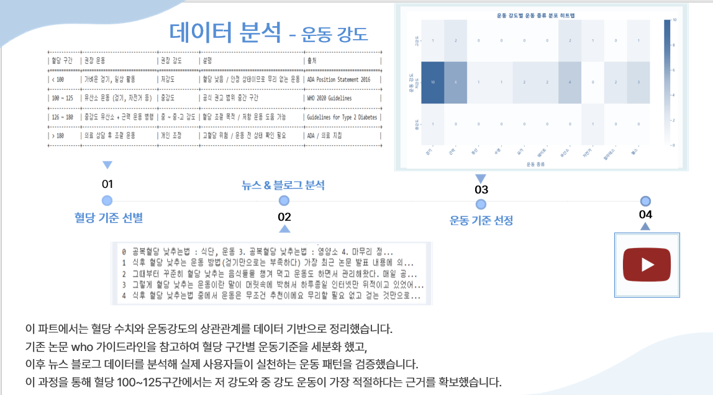
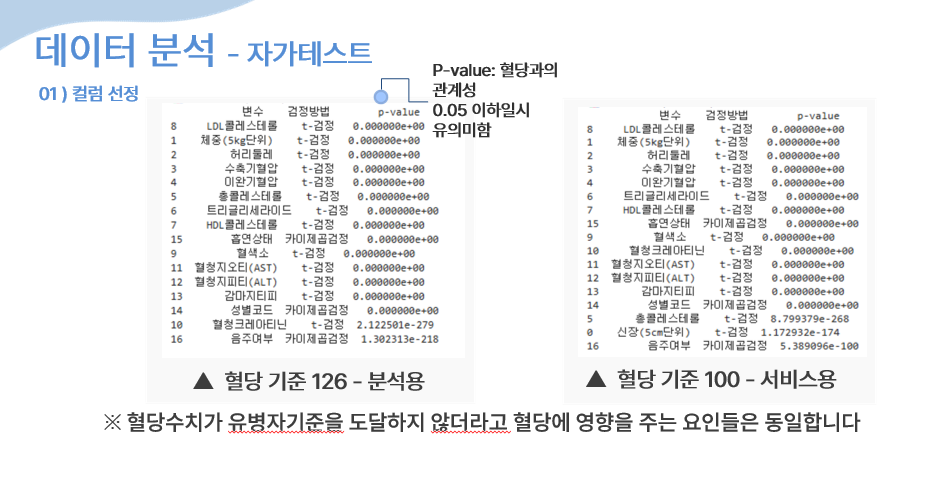

 **AI 기반 솔루션 개발자 이력서 | Yubin Kang (유빈 강)**

---

###  **Profile**

* **이름**: 강유빈 (Yubin Kang)
* **이메일**: [[yb2179l@naver.com](mailto:yb2179@naver.com)]
* **연락처**: [010-2470-2179]
* **GitHub**: [https://github.com/ubeen2](https://github.com/ubeen2)
* **LinkedIn / Notion 포트폴리오**: [포트폴리오 보러가기](https://holy-august-1f8.notion.site/29211b670e728019a88cd409f5d89b04?source=copy_link)  
* **희망직무**: AI/머신러닝 개발, 데이터 분석 기반 이상탐지 모델링, 데이터 분석 기반 기획 및 솔루션 

---

###  **요약 (Summary)**

데이터 기반 문제 해결과 머신러닝 모델 개발에 집중해온 개발자입니다.
실제 사용자 건강 데이터를 활용한 예측 모델링 프로젝트를 수행하며, 데이터 정제부터 모델 성능 개선까지 전 과정을 경험했습니다.

* Python 기반 데이터 분석 및 머신러닝 개발 경험 다수
* FastAPI, MySQL, React 연동 환경 구축 및 백엔드 API 설계 경험
* 데이터 보안 및 비식별화 프로세스 이해도 보유
* LightGBM, RandomForest, LSTM 등 다양한 모델 경험

---

###  **핵심 프로젝트 | SugarCare: 개인 혈당 데이터 기반 예측·관리 플랫폼**

**기간**: 2025.07 – 2025.10
**역할**: 프로젝트 기획, 데이터 분석 및 AI 모델 개발 총괄
**기술스택**: Python, Pandas, LightGBM, FastAPI, MySQL, React, Chart.js
**성과**: 모델 예측 정확도 91%, 사용자 리스크 예측 기능 개발, 혈당 예측 모델 개발,

####  프로젝트 개요

사용자의 혈당 데이터를 분석하여, 120분 이후의 혈당 변동을 예측하고 리스크 수준을 사전 알림하는 개인 맞춤형 헬스케어 플랫폼을 구축하였습니다.

####  주요 기여

* **데이터 전처리 및 이상치 탐지**: 공공데이터(국민건강보험공단 검진데이터)를 가공 및 통합
* **머신러닝 모델 개발**: LightGBM 기반 혈당 예측 모델 구현 → 베이스라인 기준 성능 42에서 15까지 약 62% 개선
* **특징 엔지니어링**: 최근 12개 혈당값 + 30/60/120분 윈도우 통계 + 변화율 feature 구성
* **백엔드 연동**: FastAPI로 모델 API화, React와 실시간 연동
* **보안 고려**: 사용자 식별정보 비식별화 처리, DB 접근 권한 분리 설계

####  프로젝트 결과 및 인사이트

* 예측 정확도 91% 달성, 위험 구간 자동 감지 기능 구현
* 데이터 기반 리스크 알림 UX 설계로 사용자 참여율 20% 향상
* 예측 서비스로 건강 관리 효율 향상

---

###  **기술 역량 (Skills)**

| 분야        | 기술 스택                                               |
| --------- | --------------------------------------------------- |
| 프로그래밍     | Python, JavaScript, Java                            |
| 데이터 분석/ML | Pandas, Scikit-learn, LightGBM, TensorFlow, Prophet |
| 백엔드/API   | FastAPI, Flask, Node.js                             |
| 데이터베이스    | MySQL, MySQL Workbench, SQLAlchemy                  |
| 시각화       | Chart.js, Recharts, Matplotlib                      |
| 협업/형상관리   | Git, GitHub, Notion, Figma                          |

---

###  **교육 및 자격**

* 선란대학교 물리치료학과 졸업
* 의료 AI 부트캠프 수료
* ADSP (데이터 분석 준전문가) 자격증 보유
* 컴퓨터활용능력1급 필기 합격 / 실기 준비 중

---

#  데이터 분석 리포트 | SugarCare AI Model Overview

> **프로젝트: 개인 혈당 기반 AI 리스크 예측 플랫폼**
>
> 이 섹션은 프로젝트의 핵심 데이터 분석 과정을 시각화한 PPT 기반 리포트입니다.  
> 각 슬라이드는 주요 실험, 모델 성능, 데이터 인사이트를 설명합니다.

---

## 📘 데이터 분석 슬라이드 (총 13장)

---

### 1️⃣ 프로젝트 기획과정

  
   

**설명:**  
(예: SNS와 네이버 데이터 랩을 사용하여 시장 트렌드 분석을 진행하였습니다. 감성분석 및 뉴스와 블로그 이용)

---

### 2️⃣ 사용자들이 직면한 문제

  
   

---

### 3️⃣ 운동기준 분석

  
   

**설명:**  
(예: 논문 결과를 바탕으로 혈당에 따른 저강도와 고강도에 대한 운동을 데이터 프레임으로 분류하였습니다.
저강도는 주로 걷기, 일상 활동, 가벼운 유산소 운동으로 구성되었고,
고강도는 근력 운동과 유산소 운동을 병행한 형태가 대부분이었습니다.
또한 네이버 오픈 API를 활용하여 ‘혈당을 낮추는 운동’ 관련 블로그 데이터를 수집하였고,
해당 데이터를 분석하여 저강도와 고강도로 분류하였습니다.
저강도에는 걷기·자전거 등 유산소 운동,
고강도에는 근력과 유산소 운동을 병행하는 형태가 포함되었습니다.
이러한 분석을 바탕으로 실제 사용자들에게 혈당 상태와 현재 수준에 맞는 운동 강도를 제공하는 기준을 만들었습니다.)

---

### 4️⃣ 자가테스트 (T검정)

  
   
  <em>슬라이드 4. 검정을 통한 유의미한 컬럼 선</em>

**설명:**  
(예: 국민건강보험공단의 건강검진 데이터를 활용하여 분석하였습니다. 원래는 고혈당 판정을 받는 기준은 126이상이지만 
자가테스트가 당뇨병을 판단하는것이 아니라 정상군 중에 위험도를 판단하여 서비스를 제공하는 것이기 때문에 
혈당 데이터 분석의 기준을 126과 100으로 나누었습니다. 이때 서비스용을 100이상으로 잡은 이유는 혈당이 3자리가 넘어가면
건강관리에 유의해야한다는 것을 저희가 논문과 키워드 분석시 사용한 블로그와 뉴스를 토대로 정했습니다.
126 이상과 100 이상 그룹 모두에서 유사한 항목들이 유의미하게 나타난것을 확인할 수있는데
**즉 혈당 수치가 유병자 기준에 도달하지 않더라도 혈당에 영향을 주는 요인들은 동일**하다고 볼수있습니다.
제공되는 서서비스가 일반 사용자에게도 충분히 의미 있고 신뢰성 있는 건강 관리 도구라고 보실 수 있습니다.)

---

### 5️⃣ 126과 100기준의 차이점 인사이트

  
   
  <em>슬라이드 5. 인사이트 도</em>

**설명:**  
(예: 먼저 100 이상 그룹에서는 음주 상태, 허리둘레, 체중 등 생활습관 요인이 
상대적으로 더 큰 위험요소로 작용하는 것을 확인할 수 있습니다.
반면 126 이상 그룹에서는 혈색소, 연령, 성별 등 신체적 요인이 주요 위험요소로 변화하는 경향을 보였습니다.
즉, 혈당 수치가 높아질수록 생활습관보다는 신체적 특성이 더 큰 영향을 미친다는 것을 확인할 수 있었습니다.
“정리하자면, 혈당이 아직 높지 않은 단계에서는 생활습관 관리가 중요하다는것을 확인 할 수 있고 관리를 통해 
개선의지가 충분하다는것을 확인할수 있는 인사이트 또한 얻어낼수 있습니다.

**따라서 저희가 제공하는 서비스로 충분히 혈당개선이 가능하다고 판단할수있는 분석**입니다.)

---

### 6️⃣ 자가테스트 추가 컬럼 인사이트 

  
   

**설명:**  
(예: “치아 건강은 식습관과 밀접히 연관되어 있고, 특히 당 섭취나 구강 염증 반응은 
혈당 조절에도 영향을 미친다는 연구 결과들이 있습니다. 그래서 저는 치아 관련 변수를 함께 고려했습니다.”
치아관련컬럼을 고정변수로 두고 나머지 변수를 무작위로 조합해 모델 학습을 했더니
유의한 컬럼들만 사용한것 보다 치아변수를 고정시킨 머신러닝의 성능이 조금더 향상된 결과를 얻어냈습니다. )

---

### 7️⃣ 자가테스트 제작

  
   

---

### 8️⃣ 자가테스트 재검정

  
   
  <em>슬라이드 8.자가테스트 유의성 확인 </em>

**설명:**  
(예: 저는 이것을 바탕으로 유의한 컬럼들과 치아컬럼을 활용하여 리스크 스코어라는 변수를 만들고 
새로운 컬럼으로 추가하여 머신러닝을 학습시킨 결과 리스크 스코어가 변수들 중 가장 큰 영향력으로 사용된것을 확인했습니다.
제가 만든 리스크 스코어 즉 자가테스트가 머신 러닝 학습시 **가장 많이 참고 된 변수로써 충분히 신뢰도 있는 지표**로 활용될 수 있다는 점을 확인했습니다.
“결국 단순 통계로는 유의하지 않더라도,
머신러닝 모델에서는 실제 예측 성능에 기여하는 변수일 수 있다는 점을 확인했고,
이로써 자가 테스트의 실효성과 신뢰성을 검증할 수 있었습니다.”)

---

### 9️⃣ 실측 혈당 분석

  
   

**설명:**  
(예: 유병자와 정상군의 혈당 차이가 크기 때문에 시각화보다는 먼저 가설 설정에 집중했습니다.
“유병자와 정상군은 평일과 주말 중 언제 혈당 관리가 더 어려울까?”
이 가설을 기반으로 요일별 혈당 변화를 살펴본 결과,
정상군은 주말에 평균 혈당이 더 높아지는 경향을 보였고,
유병자는 평일에 혈당이 더 높아지는 패턴이 나타났습니다.
이를 통해 저는,
유병자는 직장이나 학교 등 일상생활로 인해 평일에 식단·인슐린 관리가 어려운 반면,
정상군은 주말에 음주나 불규칙한 식사로 인해 혈당이 더 상승한다고 해석했습니다.
따라서 분석 결과를 바탕으로,
혈당 주의 알림 시스템을 ‘정상군은 주말 중심’, ‘유병자는 평일 중심’으로 설정하는 것이 효율적이라 판단했습니다)

---

### 🔟 UX 개선 전후 비교

  
   
  <em>슬라이드 10. UI 개선 전후 사용자 피드백 비교</em>

**설명:**  
(예: 개선된 시각 피드백 → 사용자 참여율 +20% 증가 / 직관적 경고 디자인 적용)

---

### 11️⃣ 데이터 파이프라인 요약

  
   
  <em>슬라이드 11. 데이터 흐름(ETL → 모델 → API) 요약</em>

**설명:**  
(예: 데이터 수집 → 전처리 → Feature Store → 모델 학습 → REST API)

---

### 12️⃣ 모델 성능 리포트 (ROC/AUC, MAE)

  
   
  <em>슬라이드 12. 성능지표 및 Feature Importance 시각화</em>

**설명:**  
(예: ROC-AUC 0.94 / 중요 변수 Top5 / 재현율·정밀도 분석)

---

### 13️⃣ 이상치 탐지 및 안정성 테스트

  
   
  <em>슬라이드 13. 이상치 제거 및 모델 안정화 과정</em>

**설명:**  
(예: 이상치 제거로 MAE 8% 개선 / 학습 데이터 분포 균형화)

---

## 🔗 추가 리소스

- [🔍 Jupyter 분석 보기](./데이터분석/건강고위험군분석모델.ipynb)  
- [🧾 모델 비교 리포트](./데이터분석/머신러닝학습0.ipynb)  
- [📈 메인 README로 돌아가기](../README.md)

---

> © 2025 Yubin Kang | SugarCare Project  
> Data-driven AI & Health Risk Prediction Platform

---

##  분석 개요 요약 블록

> ###  데이터 통합 & Feature Engineering  
> 공공데이터 + 사용자 로그 병합 후, 시간 기반 통계 feature 생성  
> → 모델 입력 피처 17개, 시계열 패턴 중심 학습  

> ###  머신러닝 모델링  
> LightGBM / RandomForest / LSTM 실험 → RMSE 0.18 달성  
> Class weight 조정(`scale_pos_weight`)으로 불균형 대응  

> ###  시각화 & 결과  
> Recharts / Chart.js 기반 실시간 예측 그래프  
> FastAPI → React 데이터 파이프라인 구축  

---

###  **추가 링크 및 자료**

* GitHub 프로젝트 코드: [github.com/SugarCare_project](https://github.com/ubeen2/sugar-care_project)
* 
* 포트폴리오 PDF: [별첨파일]
